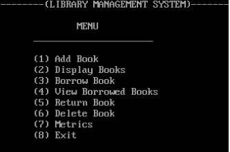
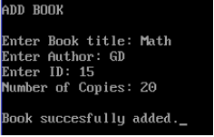
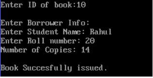
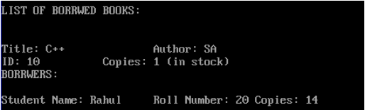
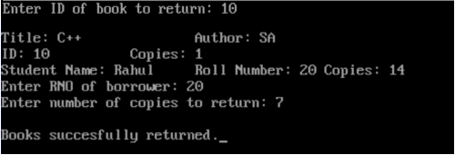

# Library Management System
A library management system performing all the basic functions written in Object-Oriented C++ 98 for my highschool computer science class.

  

## What can it do?
All the functions you'd expect a library system to do!

### 1. Add Books

  

### 2. Borrow Books

  

  

### 3. Return Books

  

### 4. View Metrics

  

